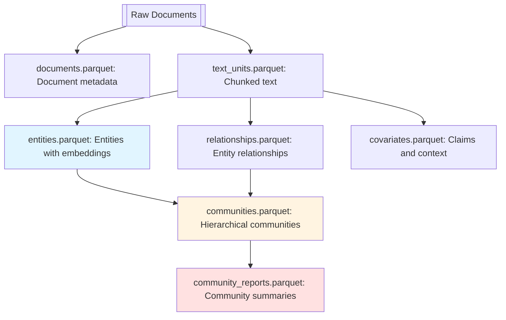
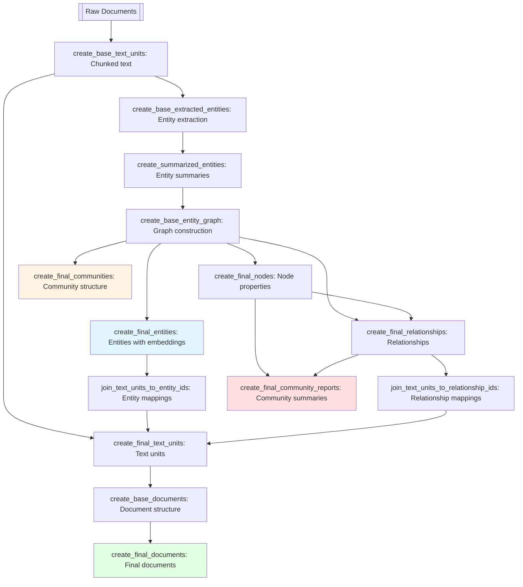

# 🥦GraphRAG Playground w/ Azure OpenAI

- Documentation: [Get Started](https://microsoft.github.io/graphrag/get_started/)  
  - [GraphRAG Accelerator](https://github.com/azure-samples/graphrag-accelerator)
  - [GitHub Repository](https://github.com/microsoft/graphrag)
  - [GraphRAG (From Local to Global) paper](https://arxiv.org/pdf/2404.16130)
- [LazyGraphRag (Affordable GraphRAG)](https://www.microsoft.com/en-us/research/blog/lazygraphrag-setting-a-new-standard-for-quality-and-cost/) still in development (as of Nov 2025): [Issue](https://github.com/microsoft/graphrag/issues/1935)

### GraphRAG Overview

- GraphRAG: Automatically builds its own graph without any user input.
- Query mode:  
  1. Global: Community scan approach  
  2. Local: Embedding lookups with minor gains compared to RAG.
  3. DRIFT Search: Enhanced local search by integrating community information into the query process.
- Indexing Pipeline
  - [DataShaper](https://github.com/microsoft/datashaper) is used for creating graph pipelines.
  - Parquet file-based storage: No specific database has been implemented for storage.
  - LanceDB: Used for embedding lookups.
  - Chunking strategy: The chunk size can be configured in the settings (default: 1200). No special methods are required for chunking.
- Integration with Third-Party Libraries
  - [Implementing "From Local to Global" GraphRAG with Neo4j and LangChain: Constructing the Graph](https://neo4j.com/developer-blog/global-graphrag-neo4j-langchain/)
  - [GraphRAG Implementation with LlamaIndex](https://developers.llamaindex.ai/python/examples/cookbooks/graphrag_v1/): GraphRAG v1
  - [LazyGraphRAG in LangChain](https://datastax.github.io/graph-rag/examples/lazy-graph-rag/)
- Web Application (Backup under `app` directory)
  - [GraphRAG Visualizer](https://noworneverev.github.io/graphrag-visualizer/)
  - [GraphRAG API Server](https://github.com/noworneverev/graphrag-api)

### Index Workflow mentioned in the paper

- 2.1 Source Documents → Text Chunks
- 2.2 Text Chunks → Element Instances: multiple rounds
- 2.3 Element Instances → Element Summaries: extract descriptions
- 2.4 Element Summaries → Graph Communities: leiden, 2-levels communities: lv0, lv1:
- 2.5 Graph Communities → Community Summaries: report-like summaries of each community
- 2.6 Community Summaries → Community Answers → Global Answer

### Indexing Workflow v2

GraphRAG v2 (2.0+) simplified the indexing workflow and output structure by removing DataShaper-based workflow naming conventions and consolidating related data.



**Key Changes from v1 to v2:**

1. **Simplified Output Files**: Removed `create_final_` prefix from all output files
2. **Consolidated Graph Data**: Merged node properties (degree, x, y coordinates) into the entities table
3. **Enhanced Community Structure**: Added `children` field to communities for easier hierarchical traversal
4. **Renamed Fields**: Changed `attributes` to `metadata` in documents table
5. **Removed Redundancy**: Eliminated the separate `nodes` table (data merged into `entities`)

**v2 Output Files:**

| File | Description | Key Fields |
|------|-------------|------------|
| **documents.parquet** | Source document metadata | id, title, metadata, text_unit_ids |
| **text_units.parquet** | Text chunks with mappings | id, text, chunk, entity_ids, relationship_ids, document_ids |
| **entities.parquet** | Entities with graph properties | id, name, type, description, text_unit_ids, description_embedding, **degree**, **x**, **y**, **frequency** |
| **relationships.parquet** | Entity relationships | source, target, description, text_unit_ids, rank, weight |
| **communities.parquet** | Community hierarchy | id, level, title, relationship_ids, text_unit_ids, **children**, parent |
| **community_reports.parquet** | Community summaries | community, title, summary, full_content, rank, **children** |
| **covariates.parquet** | Extracted claims | id, subject_id, object_id, type, status, description, text_unit_ids |

**Migration from v1 to v2:**

See `docs/index_migration_to_v2.ipynb` for the complete migration notebook.

```python
# Key transformation steps:
# 1. Rename: attributes → metadata in documents
# 2. Merge: node properties (degree, x, y) into entities
# 3. Add: children field to communities
# 4. Remove: create_final_* prefix from all files
```

- **Hierarchy**: Documents → Text units → Entities/Relationships → Communities → Community reports

- **The output files**: All files use simplified names without workflow prefixes.

      ```cmd
      documents.parquet
      text_units.parquet
      entities.parquet
      relationships.parquet
      communities.parquet
      community_reports.parquet
      covariates.parquet
      ```

### Indexing Workflow v1 (legacy)



**v1 Workflow Steps:**

| Step | Input | Output |
|------|-------|--------|
| **create_base_text_units** | Raw text documents | Chunked text |
| **create_base_extracted_entities** | Chunked text | GraphML XML with entities |
| **create_summarized_entities** | GraphML XML (entities) | GraphML XML with summaries |
| **create_base_entity_graph** | GraphML XML (summaries) | GraphML XML (base graph) |
| **create_final_entities** | GraphML XML (base graph) | Entity list with embeddings |
| **create_final_nodes** | GraphML XML (base graph) | Community ID, node properties |
| **create_final_communities** | GraphML XML (base graph) | Community ID, relationship IDs |
| **join_text_units_to_entity_ids** | Entity list with embeddings | text_unit_id → entity_ids mapping |
| **create_final_relationships** | GraphML XML + node data | Source, target, text_unit_id, rank |
| **join_text_units_to_relationship_ids** | Relationship data | text_unit_id → relationship_ids mapping |
| **create_final_community_reports** | Community + relationship data | AI-generated community summaries |
| **create_final_text_units** | Chunked text + mappings | text_unit_id, entity_ids, relationship_ids |
| **create_base_documents** | Text unit mappings | Document and text_unit_ids |
| **create_final_documents** | Document structure | Final documents with metadata |

- **Hierarchy**: Documents → Text units → Entity IDs, relationship IDs → Communities → Community reports

- **The files with 'final' in their names**: The item tagged with 'final' is the final result. These will be used for rendering a graph.

      ```cmd
      create_final_entities.parquet
      create_final_relationships.parquet
      create_final_documents.parquet
      create_final_text_units.parquet
      create_final_communities.parquet
      create_final_community_reports.parquet
      create_final_covariates.parquet
      ```

## Quick Start

#### Initialize your repository

This will create two files: `.env` and `settings.yaml`. See samples in `.env.sample` and `settings.yaml.sample`.

```bash
graphrag init
```

#### Configuration (Azure OpenAI)

.env

```bash
GRAPHRAG_API_KEY=<your-azure-openai-key>
```

settings.yaml

```yaml
models:
  default_chat_model:
    type: chat
    api_base: https://<instance>.openai.azure.com
    api_version: <your-api-version>
    deployment_name: <azure_model_deployment_name>
  default_embedding_model:
    type: embedding
    api_base: https://<instance>.openai.azure.com
    api_version: <your-api-version>
    deployment_name: <azure_embedding_deployment_name>
```

## Glossary

#### verb

- Workflows are expressed as sequences of steps, which we call verbs. Each step has a verb name and a configuration object. In DataShaper, these verbs model relational concepts such as SELECT, DROP, JOIN, etc.. Each verb transforms an input data table, and that table is passed down the pipeline.

#### claims

- A claim might not be explicitly stated in the source text but can be inferred from the context. For example, if a text mentions that “Gustave Eiffel designed a famous landmark in Paris,” we can deduce the claim that “The Eiffel Tower is located in Paris” based on our knowledge that the Eiffel Tower is the famous landmark designed by Gustave Eiffel. This inferred information helps provide a more comprehensive understanding of the relationships between entities.

#### gleaning

- The quality of chucking depends on the context size. When targeting long texts after gleaning, there are significant differences in the number of entities extracted. To maximize entity extraction, multiple rounds of gleaning are performed. > `CONTINUE_PROMPT` & `LOOP_PROMPT` in [src](https://github.com/microsoft/graphrag)

#### rank

- r(G) = n - c, where n is the number of vertices (nodes) in the graph and c is the number of connected components.

---

## Reference

- [GraphRAG using Local LLMs](https://github.com/severian42/GraphRAG-Local-UI)
- [nano-graphrag](https://github.com/gusye1234/nano-graphrag)
- [Deploy the GraphRAG index creation workflow to Azure Machine Learning](https://github.com/KazuOnuki/GraphRAG-Index-SimpleBuilder)
- [GraphRAG-SimpleUI-Builder](https://github.com/KazuOnuki/GraphRAG-SimpleUI-Builder)
- [階層 Leiden クラスタリング](https://qiita.com/nohanaga/items/75305fc63602bd2cdaca)
- [graphrag-cosmosdb-AI-search-intergration](https://github.com/huqianghui/graphrag-cosmosdb-AI-search-intergration)
